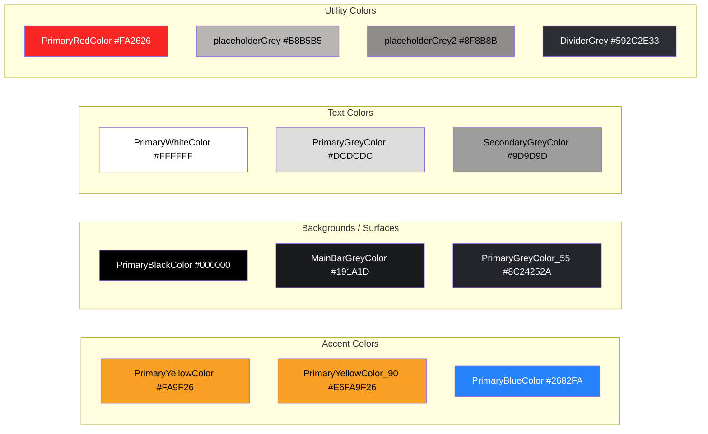
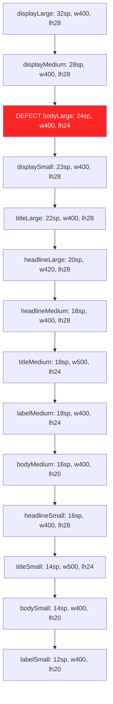
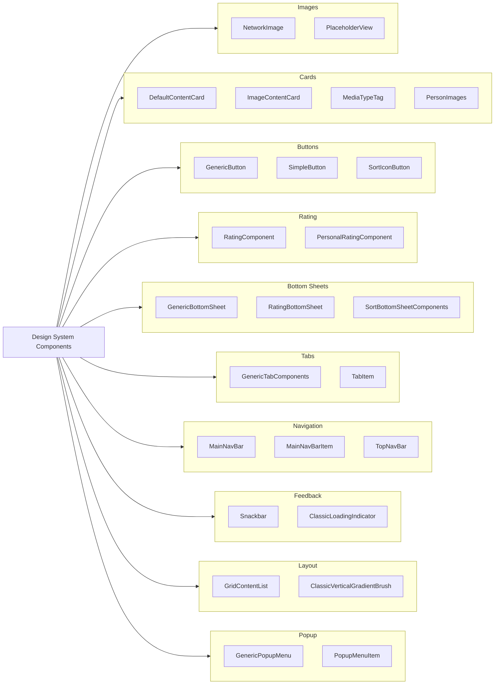
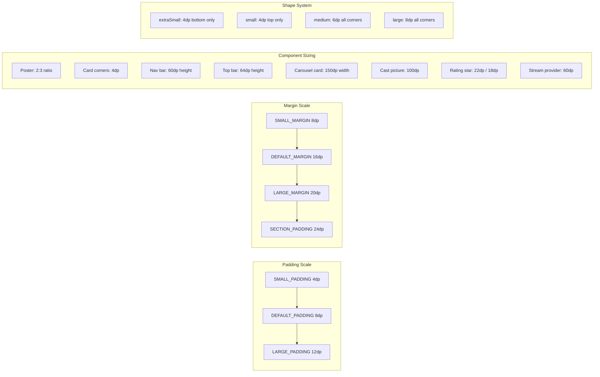

# Design System Figma Setup — Implementation Plan

> **For agentic workers:** REQUIRED SUB-SKILL: Use superpowers:subagent-driven-development (recommended) or superpowers:executing-plans to implement this plan task-by-task. Steps use checkbox (`- [ ]`) syntax for tracking.

**Goal:** Document CineTracker's existing Compose design system as Figma MCP rules and create FigJam visual reference diagrams, with improvement recommendations.

**Architecture:** Two Figma MCP tools are used sequentially: `create_design_system_rules` generates a codebase-aware rules file, then `generate_diagram` creates multiple Mermaid-based FigJam diagrams (color palette, typography scale, component inventory, spacing system). The rules file lives in the repo; diagrams are hosted in Figma.

**Tool limitation:** `generate_diagram` only supports Mermaid.js diagrams (flowcharts, sequence, state, gantt) — not arbitrary visual layouts. The FigJam diagrams will be structured informational flowcharts, not pixel-perfect design sheets with color swatches or typography samples. They serve as a categorized reference, not a visual design tool.

**Tech Stack:** Figma MCP plugin, Mermaid.js (for FigJam diagrams), Kotlin/Compose Multiplatform (source codebase)

**Spec:** `docs/superpowers/specs/2026-03-22-design-system-figma-setup-design.md`

---

## Task 1: Generate Design System Rules

Use the Figma MCP `create_design_system_rules` tool to scan the codebase and produce a rules file encoding CineTracker's design tokens, components, and conventions.

**Files:**
- Read (context): `composeApp/src/commonMain/kotlin/common/ui/theme/Color.kt`
- Read (context): `composeApp/src/commonMain/kotlin/common/ui/theme/Type.kt`
- Read (context): `composeApp/src/commonMain/kotlin/common/ui/theme/Shape.kt`
- Read (context): `composeApp/src/commonMain/kotlin/common/ui/theme/Theme.kt`
- Read (context): `composeApp/src/commonMain/kotlin/common/util/UiConstants.kt`
- Create: Rules file (output location determined by the MCP tool)

- [ ] **Step 1: Run `create_design_system_rules`**

Call the Figma MCP tool with:
- `clientFrameworks`: `compose-multiplatform, material3`
- `clientLanguages`: `kotlin`

The tool will analyze the codebase and return a prompt/instructions for generating the rules. Follow its output to produce the rules file.

- [ ] **Step 2: Review the generated rules for accuracy**

Verify the rules file against the actual code:
- All 13 color tokens from `Color.kt` are present with correct hex values
- All 14 typography styles from `Type.kt` are listed with correct sp/weight values
- All 4 shape variants from `Shape.kt` are documented
- Spacing constants from `UiConstants.kt` are included
- Component inventory covers the ~20 composables in `common/ui/components/`

Cross-check that the rules reference code values, NOT the potentially outdated `.claude/rules/style.md`.

- [ ] **Step 3: Verify the rules file is saved in the repo**

Confirm the file exists and check its location. If the tool didn't auto-save, manually save it to the project root or a `.figma/` directory.

- [ ] **Step 4: Commit**

```bash
git add <rules-file-path>
git commit -m "Add Figma design system rules"
```

---

## Task 2: Create Color Palette FigJam Diagram

Generate a FigJam flowchart showing all color tokens with their hex values, organized by category, using colored nodes.

- [ ] **Step 1: Create the color palette diagram**

Call `generate_diagram` with:
- `name`: `CineTracker Color Palette`
- `userIntent`: `Visual reference of all color tokens in the CineTracker design system, organized by category (accent, backgrounds/surfaces, text, utility), showing token names and hex values with colored nodes`
- `mermaidSyntax`:



- [ ] **Step 2: Record the returned FigJam URL**

Save the URL from the tool response. This will be collected at the end for the user.

---

## Task 3: Create Typography Scale FigJam Diagram

Generate a FigJam flowchart showing the full typography hierarchy from largest to smallest, flagging the known hierarchy defect.

- [ ] **Step 1: Create the typography scale diagram**

Call `generate_diagram` with:
- `name`: `CineTracker Typography Scale`
- `userIntent`: `Visual hierarchy of all 14 typography styles in CineTracker, showing font size, weight, and line height for each style, ordered from largest to smallest, with a warning flag on bodyLarge (24sp) which breaks the Material3 hierarchy`
- `mermaidSyntax`:



- [ ] **Step 2: Record the returned FigJam URL**

Save the URL from the tool response.

---

## Task 4: Create Component Inventory FigJam Diagram

Generate a FigJam flowchart categorizing all reusable components.

- [ ] **Step 1: Create the component inventory diagram**

Call `generate_diagram` with:
- `name`: `CineTracker Component Inventory`
- `userIntent`: `Categorized inventory of all reusable composable components in CineTracker's design system, grouped by category with component names and brief descriptions`
- `mermaidSyntax`:



- [ ] **Step 2: Record the returned FigJam URL**

Save the URL from the tool response.

---

## Task 5: Create Spacing & Sizing FigJam Diagram

Generate a FigJam flowchart documenting the spacing scale, key sizing constants, and the shape system.

**Note:** The spec lists the Shape System as its own FigJam section. It is intentionally consolidated here with Spacing & Sizing since both are small structural references that fit naturally together.

- [ ] **Step 1: Create the spacing system diagram**

Call `generate_diagram` with:
- `name`: `CineTracker Spacing and Sizing System`
- `userIntent`: `Visual reference of CineTracker's spacing scale (padding and margin constants), key component sizing values, and shape system (corner radius variants)`
- `mermaidSyntax`:



- [ ] **Step 2: Record the returned FigJam URL**

Save the URL from the tool response.

---

## Task 6: Compile Results and Final Summary

Collect all outputs and present them to the user.

- [ ] **Step 1: Compile all FigJam URLs**

Gather the 4 diagram URLs from Tasks 2-5 and present them as a summary:
1. Color Palette — [URL]
2. Typography Scale — [URL]
3. Component Inventory — [URL]
4. Spacing & Sizing — [URL]

- [ ] **Step 2: Summarize improvement recommendations**

Based on the rules generation output and the diagrams, summarize the key improvement recommendations:
- **Typography defect**: bodyLarge (24sp) breaks the Material3 hierarchy
- **Semantic naming**: Tokens like MainBarGreyColor, SecondaryGreyColor could use semantic names
- **Missing tokens**: State tokens (disabled, hover/pressed, focus) are absent
- **Token usage inconsistency**: Some components use MaterialTheme, others import colors directly
- **Color contrast**: Flag any pairs that may not meet WCAG AA

- [ ] **Step 3: Commit the spec and plan docs**

```bash
git add docs/superpowers/
git commit -m "Add design system spec and implementation plan"
```
